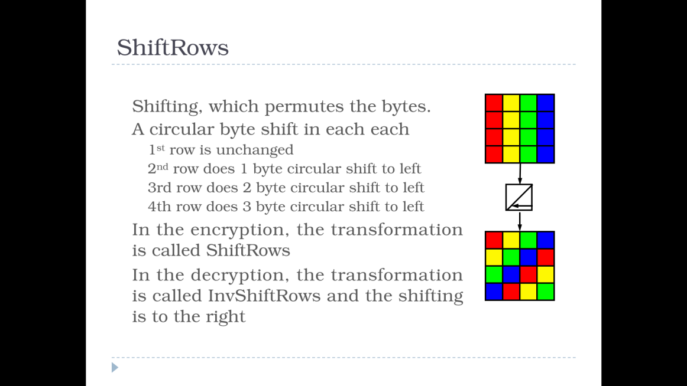
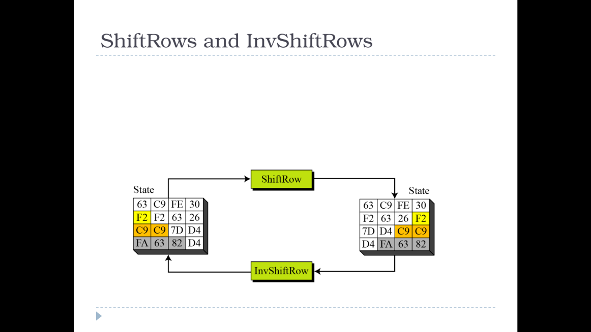
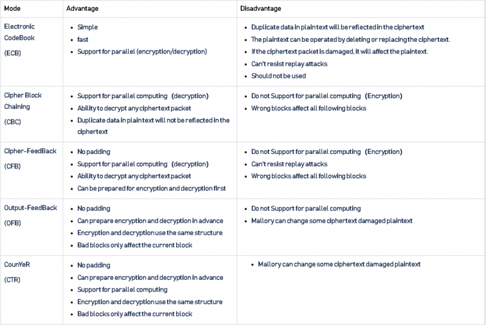

# AES-NI
use of the AES-NI instruction set read aes_ni.pdf for more information

# Be careful

be careful words is considered as 32 bits chunks by FIPS197

AES Key expansion : https://www.brainkart.com/article/AES-Key-Expansion_8410/

# AES Key Length

| MOD |   Key Bytes |  NR |
|-----|:-----------:|----:|
| 128 |  16 Bytes   | 10  |
| 192 |  24 Bytes   | 12  |
| 256 |  32 Bytes   | 14  |

# AES-NI ?

Intel has implemented AES with a hardware implementation since March 2008
Reference : https://en.wikipedia.org/wiki/AES_instruction_set

# Why Intel do that ?

The Advanced Encryption Standard (AES) is the Federal Information Processing
Standard for symmetric encryption, and it is defined by FIPS Publication #197 (2001).
From the cryptographic perspective, AES is widely believed to be secure and efficient,
and is therefore broadly accepted as the standard for both government and industry
applications. In fact, almost any new protocol requiring symmetric encryption supports
AES, and many existing systems that were originally designed with other symmetric
encryption algorithms are being converted to AES. Given the popularity of AES and its
expected long term importance, improving AES performance and security has significant
benefits for the PC client and server platforms.
Intel is introducing a new set of instructions beginning with the all new 2010 Intel®
Core™ processor family based on the 32nm Intel® microarchitecture codename
Westmere.

The new architecture has six instructions: four instructions (AESENC, AESENCLAST,
AESDEC, and AESDELAST) facilitate high performance AES encryption and decryption,
and the other two (AESIMC and AESKEYGENASSIST) support the AES key expansion.
Together, these instructions provide full hardware support for AES, offering high
performance, enhanced security, and a great deal of software usage flexibility
The Intel AES New Instructions can support AES encryption and decryption with each
one of the standard key lengths (128, 192, and 256 bits), using the standard block size
of 128 bits (and potentially also other block sizes for generalized variants such as the
RIJNDAEL algorithms). They are well suited to all common uses of AES, including bulk
encryption/decryption using cipher modes such as ECB, CBC and CTR, data
authentication using CBC-MACs (e.g., CMAC), random number generation using
algorithms such as CTR-DRBG, and authenticated encryption using modes such as GCM.
It is believed that these instructions will be useful for a wide range of cryptographic
applications.

This paper provides an overview of the AES algorithm and guidelines for utilizing the
Intel AES New Instructions to achieve high performance and secure AES processing.
Some special usage models of this architecture are also described. This version of the
paper also provides a high performance library for implementing AES in the
ECB/CBC/CTR modes of operation, and discloses, for the first time, the performance
numbers for the provided code.

# FIPS197 ?

Federal Information Processing Standard is a standard in US like ANSI, ISO or IEEE.
https://nvlpubs.nist.gov/nistpubs/fips/nist.fips.197.pdf

# Keyword AES

# Cipher Key of AES

AES is a symmetric (same key to cipher/uncipher) key encryption algorithm.
It uses a cipher key whose length is 128 bits, 192 bits or 256 bits.
The AES algorithm with a cipher key of length 128, 192, 256 bits is denoted AES-128, AES-192, AES-256, respectively check the table as above.

# What is State ?

The process of encryption (decryption) of plaintext (ciphertext) to ciphertext (plaintext)
generates intermediate 128-bit results. These intermediate results are referred to as the
State. For those who do a little assembly keep in mind that the SSE extension on x86 CPUs have 16 registers of 128 bit called xmm register
we will see it a little later when we will test the implementation that intel made.

# What is Data blocks ?

AES operates on an input data block of 128 bits and its output is also a data block of
128 bits.

# Round Keys ?

AES-128, AES192, and AES-256 algorithms expand the cipher key to 10, 12, and 14
round keys, respectively.
The length of each round key is 128 bits.
The algorithm for deriving the round keys from the cipher key is the called the AES Key Expansion.

# AddRound Keys ?

AddRoundKey is a (128-bit, 128-bit) -> 128-bit transformation, which is defined as the
bit-wise xor of its two arguments.
In the AES flow, these arguments are the State and the round key. AddRoundKey is its own inverse.

# Counting the Rounds and the Round Keys ?

The AES algorithm starts with a whitening step, implemented by XOR-ing the input data
block with the first 128 bits of the cipher key. These 128 bits are the whitening key. The
algorithm continues with 10/12/14 rounds, each one using another round key. When
counting this way, the rounds and the round keys are counted from 1 to 10/12/14,
accordingly. However, sometimes the whitening step is also referred to as “Round 0”,
and the corresponding 128 bits of the whitening key are referred to as Round Key 0. In
that case, the count of the AES rounds and the round keys starts from 0 to 10/12/14.
We use these conventions interchangeably.

# What is S-Box ?

In cryptography, an S-box (substitution-box) is a basic component of symmetric key algorithms which performs substitution.
In block ciphers, they are typically used to obscure the relationship between the key and the ciphertext, thus ensuring Shannon's property of confusion. Mathematically, an S-box is a vectorial Boolean function.[1]
In general, an S-box takes some number of input bits, m, and transforms them into some number of output bits, n, where n is not necessarily equal to m.
An m×n S-box can be implemented as a lookup table with 2m words of n bits each. Fixed tables are normally used, as in the Data Encryption Standard (DES), but in some ciphers the tables are generated dynamically from the key (e.g. the Blowfish and the Twofish encryption algorithms).
is like a substitution table.

Example usage of S-BOX and inverse S-BOX

The S-Box and InvS-Box transformations can also be defined by lookup table as follows.
The input to the lookup tables is a byte B [7-0] where x and y denote its low and high
nibbles: x [3-0] = B [7-4], y [3-0] = B [3-0].The output byte is encoded in the table as
a two digit number in hexadecimal notation. For example, S-Box lookup for the input 85
(x=8; y=5 in hexadecimal notation) yields 97 in hexadecimal notation. InvS-Box lookup
for the input 97 yields 85. we can determine bytes like that : 97 & 0xF for y and 97 >> 4 for x

# Example of S-Box:

S-Box lookup table:

```c
					y
|     	  0  1  2  3  4  5  6  7  8  9  a  b  c  d  e  f	|
|	0 63 7c 77 7b f2 6b 6f c5 30 01 67 2b fe d7 ab 76	|
|	1 ca 82 c9 7d fa 59 47 f0 ad d4 a2 af 9c a4 72 c0	|
|	2 b7 fd 93 26 36 3f f7 cc 34 a5 e5 f1 71 d8 31 15	|
|	3 04 c7 23 c3 18 96 05 9a 07 12 80 e2 eb 27 b2 75	|
|	4 09 83 2c 1a 1b 6e 5a a0 52 3b d6 b3 29 e3 2f 84	|
|	5 53 d1 00 ed 20 fc b1 5b 6a cb be 39 4a 4c 58 cf	|
|x	6 d0 ef aa fb 43 4d 33 85 45 f9 02 7f 50 3c 9f a8	|
|	7 51 a3 40 8f 92 9d 38 f5 bc b6 da 21 10 ff f3 d2	|
|	8 cd 0c 13 ec 5f 97 44 17 c4 a7 7e 3d 64 5d 19 73	|
|	9 60 81 4f dc 22 2a 90 88 46 ee b8 14 de 5e 0b db	|
|	a e0 32 3a 0a 49 06 24 5c c2 d3 ac 62 91 95 e4 79	|
|	b e7 c8 37 6d 8d d5 4e a9 6c 56 f4 ea 65 7a ae 08	|
|	c ba 78 25 2e 1c a6 b4 c6 e8 dd 74 1f 4b bd 8b 8a	|
|	d 70 3e b5 66 48 03 f6 0e 61 35 57 b9 86 c1 1d 9e	|
|	e e1 f8 98 11 69 d9 8e 94 9b 1e 87 e9 ce 55 28 df	|
|	f 8c a1 89 0d bf e6 42 68 41 99 2d 0f b0 54 bb 16	|
```

Inversed S-Box lookup table:

```
					y
  	  0  1  2  3  4  5  6  7  8  9  a  b  c  d  e  f
	0 52 09 6a d5 30 36 a5 38 bf 40 a3 9e 81 f3 d7 fb 
	1 7c e3 39 82 9b 2f ff 87 34 8e 43 44 c4 de e9 cb
	2 54 7b 94 32 a6 c2 23 3d ee 4c 95 0b 42 fa c3 4e
	3 08 2e a1 66 28 d9 24 b2 76 5b a2 49 6d 8b d1 25
	4 72 f8 f6 64 86 68 98 16 d4 a4 5c cc 5d 65 b6 92
	5 6c 70 48 50 fd ed b9 da 5e 15 46 57 a7 8d 9d 84
x	6 90 d8 ab 00 8c bc d3 0a f7 e4 58 05 b8 b3 45 06
	7 d0 2c 1e 8f ca 3f 0f 02 c1 af bd 03 01 13 8a 6b
	8 3a 91 11 41 4f 67 dc ea 97 f2 cf ce f0 b4 e6 73
	9 96 ac 74 22 e7 ad 35 85 e2 f9 37 e8 1c 75 df 6e
	a 47 f1 1a 71 1d 29 c5 89 6f b7 62 0e aa 18 be 1b
	b fc 56 3e 4b c6 d2 79 20 9a db c0 fe 78 cd 5a f4
	c 1f dd a8 33 88 07 c7 31 b1 12 10 59 27 80 ec 5f
	d 60 51 7f a9 19 b5 4a 0d 2d e5 7a 9f 93 c9 9c ef
	e a0 e0 3b 4d ae 2a f5 b0 c8 eb bb 3c 83 53 99 61
	f 17 2b 04 7e ba 77 d6 26 e1 69 14 63 55 21 0c 7d
```

# Details of Each round

1 - One AddRoundkey is applied before the first round
2 - The MixColumns transformation is missing in the last round

| STEP |   Details     |
|------|:-------------:|
|  0   |   State       |
|  1   |   SubBytes    |
|  2   |   ShiftRows   |
|  3   |   MixColumns  |
|  4   |   AddRoundKey |
|  5   |  Output State |

# SubBytes Transformation

SubBytes is the 16-byte -> 16-byte transformation defined by applying the S-Box
transformation to each one of the 16 bytes of the input, namely:
[P,O,N,M,L,K,J,I,H,G,F,E,D,C,B,A] -> [S-Box (P), S-Box (O), S-Box (N), S-Box (M), S-Box (L), S-Box (K), S-Box (J), S-Box (I), S-Box (H), S-Box (G), S-Box (F),
S-Box (E), S-Box (D), S-Box (C), S-Box (B), S-Box (A)]

Example :
SubBytes (73744765635354655d5b56727b746f5d) = 8f92a04dfbed204d4c39b1402192a84c

# Inverse SubBytes Transformation

InvSubBytes is a 16-byte -> 16-byte transformation defined by applying the InvS-Box
function to each byte of the input, namely:
[P,O,N,M,L,K,J,I,H,G,F,E,D,C,B,A] -> [InvS-Box (P), InvS-Box (O), InvS-Box (N),
InvS-Box (M), InvS-Box (L), InvS-Box (K), InvS-Box (J), InvS-Box (I), InvS-Box
(H), InvS-Box (G), InvS-Box (F), InvS-Box (E), InvS-Box (D), InvS-Box (C),
InvS-Box (B), InvS-Box (A)]

Example :
InvSubBytes (5d7456657b536f65735b47726374545d) = 8dcab9bc035006bc8f57161e00cafd8d

# ShiftRows Transformation



ShiftRows is the following byte-wise permutation: (15, 14, 13, 12, 11, 10, 9, 8, 7, 6, 5,
4, 3, 2, 1, 0) -> (11, 6, 1, 12, 7, 2, 13, 8, 3, 14, 9, 4, 15, 10, 5, 0). 
In the P-A notation is reads [P,O,N,M,L,K,J,I,H,G,F,E,D,C,B,A] -> [L,G,B,M,H,C,N,I,D,O,J,E,P,K,F,A].
Its name comes from viewing the transformation as an operation on the 4x4 matrix
representation of the State. Under this view, the first row is unchanged, the second row
is left rotated by one byte position, the third row is left rotated by two byte positions,
and the fourth row is left rotated by three byte positions.

Example ShiftRows:
ShiftRows (7b5b54657374566563746f725d53475d) = 73744765635354655d5b56727b746f5d

InvShiftRows is the inverse of ShiftRows.
It is the following byte-wise permutation: (15,14, 13, 12, 11, 10, 9, 8, 7, 6, 5, 4, 3, 2, 1, 0) -> (3, 6, 9, 12, 15, 2, 5, 8, 11, 14, 1, 4, 7, 10, 13, 0). 
In the P-A notation is reads [P,O,N,M,L,K,J,I,H,G,F,E,D,C,B,A] -> [D,G,J,M,P,C,F,I,L,O,B,E,H,K,N,A] 

Example Inversed ShiftRows:
InvShiftRows (7b5b54657374566563746f725d53475d) = 5d7456657b536f65735b47726374545d 



# MixColumns Transformation

MixColumns is a 16-byte -> 16-byte transformation operating on the columns of the 4x4
matrix representation of the input. The transformation treats each column as a third
degree polynomial with coefficients in AES-GF256-Field. Each column of the 4x4 matrix
representation of the State is multiplied by polynomial a(x) = {03}x3
 + {01}x2
 + {01}x
+ {02} and reduced modulo x4
 + 1. Here, { } denotes an element in AES-GF256-Field.
The equations that define MixColumns are detailed in Figure 3. The transformation is [P
– A] -> [P’ – A’]; the symbol • denotes multiplication in AES-GF256-Field (i.e., • is a
carry-less multiplication followed by reduction modulo 0x11b); the symbol + denotes
XOR. 

```
A' = ({02} • A) + ({03} • B) + C + D
B' = A + ({02} • B) + ({03} • C) + D
C' = A + B + ({02} • C) + ({03} • D)
D' = ({03} • A) + B + C + ({02} • D)
E' = ({02} • E) + ({03} • F) + G + H
F' = E + ({02} • F) + ({03} • G) + H
G' = E + F + ({02} • G) + ({03} • H)
H' = ({03} • E) + F + G + ({02} • H)
I' = ({02} • I) + ({03} • J) + K + L
J' = I + ({02} • J) + ({03} • K) + L
K' = I + J + ({02} • K) + ({03} • L)
L' = ({03} • I) + J + K + ({02} • L)
M' = ({02} • M) + ({03} • N) + O + P
N' = M + ({02} • N) + ({03} • O) + P
O' = M + N + ({02} • O) + ({03} • P)
P' = ({03} • M) + N + O + ({02} • P)
```

Example of MixColumns

MixColums (627a6f6644b109c82b18330a81c3b3e5) = 7b5b54657374566563746f725d53475d

# InvMixColumns Transformation

InvMixColumns is a 16-byte Æ 16-byte transformation operating on the columns of the
4x4 matrix representation of the input. It is the inverse of MixColumns. The
transformation treats each column as a third degree polynomial with coefficients in AESGF256-Field. Each column of the 4x4 matrix representation of the state is multiplied by
polynomial a-1(x) = {0b}x3
 + {0d}x2
 + {09}x + {0e} and reduced modulo x4
 + 1. The equations that define InvMixColumns are detailed in Figure 4. The transformation is [P – A] -> [P’– A’]; 
the symbol • denotes multiplication in AES-GF256-Field (i.e., • is a carry-less
multiplication followed by reduction mod 0x11b); the symbol + denotes XOR.

```
A' = ({0e} • A) + ({0b} • B) + ({0d} • C) + ({09} • D)
B' = ({09} • A) + ({0e} • B) + ({0b} • C) + ({0d} • D)
C' = ({0d} • A) + ({09} • B) + ({0e} • C) + ({0b} • D)
D' = ({0b} • A) + ({0d} • B) + ({09} • C) + ({0e} • D)
E' = ({0e} • E) + ({0b} • F) + ({0d} • G) + ({09} • H)
F' = ({09} • E) + ({0e} • F) + ({0b} • G) + ({0d} • H)
G' = ({0d} • E) + ({09} • F) + ({0e} • G) + ({0b} • H)
H' = ({0b} • E) + ({0d} • F) + ({09} • G) + ({0e} • H)
I' = ({0e} • I) + ({0b} • J) + ({0d} • K) + ({09} • L)
J' = ({09} • I) + ({0e} • J) + ({0b} • K) + ({0d} • L)
K' = ({0d} • I) + ({09} • J) + ({0e} • K) + ({0b} • L)
L' = ({0b} • I) + ({0d} • J) + ({09} • K) + ({0e} • L)
M' = ({0e} • M) + ({0b} • N) + ({0d} • O) + ({09} • P)
N' = ({09} • M) + ({0e} • N) + ({0b} • O) + ({0d} • P)
O' = ({0d} • M) + ({09} • N) + ({0e} • O) + ({0b} • P)
P' = ({0b} • M) + ({0d} • N) + ({09} • O) + ({0e} • P)
```

InvMixColumns (8dcab9dc035006bc8f57161e00cafd8d) = d635a667928b5eaeeec9cc3bc55f5777

# SubWord Transformation

SubWord is the doubleword -> doubleword transformation defined by applying the SBox transformation to each one of the 4 bytes of the input, namely:
SubWord (X) = [S-Box(X[31-24]), S-Box(X[23-16]), S-Box(X[15-8]), S-Box(X[7-0])]

Example :
	SubWord (73744765) = 8f92a04d

# ROTWord Transformation

RotWord is the doubleword -> doubleword transformation defined by:
RotWord (X [31-0]) = [X[7-0], X [31-24], X [23-16], X [15-8]]
(in C language notation, RotWord(X) = (X >> 8) | (X << 24))

RotWord (3c4fcf09) = 093c4fcf

# Round Constant

The AES key expansion procedure uses ten constants called Round Constants
(RCON hereafter). The ten RCON values are RCON [i] = {02}i-1 for i=1, 2, …, 10,
where the operations are in AES-GF256-Field.
Each RCON value is an element of AES-GF256-Field, and is encoded here as a byte. The
ten RCON values are (in hexadecimal notation):
RCON [1] = 0x01, RCON [2] = 0x02, RCON [3] = 0x04, RCON [4] = 0x08, RCON [5] = 0x10,
RCON [6] = 0x20, RCON [7] = 0x40, RCON [8] = 0x80, RCON [9] = 0x1B, RCON [10] = 0x36.
Remark: in the following RCON values are also viewed, interchangedly, as doublewords
where their 24 leftmost bits equal 0. For example, RCON [7] = 0x00000040 (in
hexadecimal notation).


# Key Expansion

AES uses a cipher key whose length is 128, 192 or 256 bits. This cipher key is
expanded into 10, 12, or 14 round keys, respectively, using the “Key Expansion”
algorithm, where the length of each round key is 128 bits. This Key Expansion
algorithm depends only on the cipher key. Since it is independent of the processed data,
it can be (and typically is) executed prior to the encryption/decryption phase. At the
heart of the Key Expansion algorithm is the combination of the transformations
SubWord(RotWord(tmp)) and SubWord(tmp) and the use of the RCON values. Figure 5
shows the pseudo code for the AES Key Expansion algorithm (as described in FIPS197).

```c
Parameters
Nb = 4 (data blocks are of 128 bits)
Nk = number of doublewords in the cipher key
 (4, 6, 8 for AES-128, AES-192, AES-256, resp.)
Nr = number of rounds in the cipher
 (Nr=10, 12, 14 for AES-128, AES-192, AES-256, respectively).
```

```c
The Key Expansion routine
KeyExpansion(byte key[4*Nk], word w[Nb*(Nr+1)], Nk)
	begin
		word tmp
		i = 0
		while (i < Nk)
 			w[i] = word(key[4*i], key[4*i+1], key[4*i+2], key[4*i+3])
 			i = i+1
		end while
		i = Nk
		while (i < Nb * (Nr+1))
 			tmp = w[i-1]
 			if (i mod Nk = 0)
 				tmp = SubWord(RotWord(tmp)) xor RCON[i/Nk]
			else if (Nk = 8)
 				tmp = SubWord(tmp)
 			end if
 			w[i] = w[i-Nk] xor tmp
 			i = i + 1
		end while
```

# Initialization Vector (IV)

An initialization vector (or IV) are used to ensure that the same value encrypted multiple times, even with the same secret key, will not always result in the same encrypted value. This is an added security layer. If strings did always have the same result when encrypted, it would be easier for someone to figure out what the starting value was just through brute force trial and error.

In the example above, an iv is created by generating a random string of the same length as the block size (so our iv will be 16 bytes, or characters, as we mentioned above). This value is then passed in to the initialization of the cipher so that it can be used by the library code when encrypting the value.

# Padding What is that ?

When we actually call encrypt on our cipher (which has been initialized with the encryption key, encryption mode, and initialization vector), you’ll notice we’re also calling pad on the value we’re encrypting first. This goes back to the concept of “block size” that we talked about earlier. Because AES is a block cipher that works on “blocks” of a predefined length, if the value we’re encrypting isn’t cleanly divisible by that length, it won’t work. Calling pad on the value adds empty bytes to the end of your string until it’s the correct number of bytes long.

# The difference in five modes in the AES encryption algorithm

ECB mode: Electronic Code Book mode
CBC mode: Cipher Block Chaining mode
CFB mode: Cipher FeedBack mode
OFB mode: Output FeedBack mode
CTR mode: Counter mode

More information at 



# Attack on AES

PA: Padding attack
CPA: Chosen Plaintext Attack
CCA: Chosen Ci
